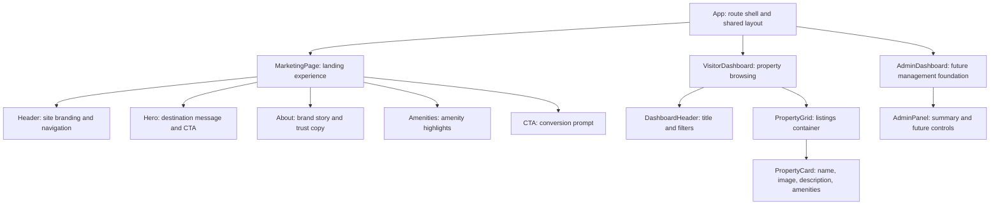

# Product Requirements Document

## Project Overview

**Product Name:** Maui Luxury Vacation Rentals Dashboard  
**Island:** Maui  
**Primary Visitor Segment:** Canadian vacationers escaping winter and looking for affordable, local vacation rentals on Maui.

This product is a three-page React web application that introduces Maui vacation rentals to first-time visitors, helps travelers browse available properties, and gives the property manager a simple operational view of listings. The first page is a **Marketing Page** designed to attract visitors with a clear value proposition, property highlights, and a strong call to action. The second page is a **Visitor Dashboard** that displays property cards pulled from the Express and MongoDB backend built in Week 11. The third page is an **Admin Dashboard foundation** that supports future listing management workflows, even if those management tools are not fully implemented in this phase.

The core business goal is to turn curious visitors into serious shoppers by presenting Maui rentals in a way that feels trustworthy, scenic, and easy to scan. The marketing experience should emphasize island appeal, affordable local stays, and amenities that matter to Canadian travelers, such as kitchens, parking, beach access, and comfortable long-stay features. The Visitor Dashboard should extend that journey by letting users review multiple rentals in one place without confusion.

This PRD focuses on **why** the React frontend exists and **what** it must deliver. The marketing page should quickly communicate the rental brand and target audience, while the Visitor Dashboard foundation should establish reusable React components, predictable props, and clean data flow from the existing API. The final result should be a small but structured React interface that can scale into the broader Term Project without major redesign.

## User Personas

**Persona 1: Target Visitor**  
Name: Claire, age 34, from Vancouver. Claire is planning a winter escape with her partner and wants a Maui stay that is scenic, affordable, and more personal than a resort. She prefers a simple website that immediately shows beautiful accommodations, explains what makes the properties unique, and gives her confidence that the listings are real. Her goal is to browse quickly, compare amenities, and move toward booking interest.

**Persona 2: Property Admin**  
Name: Kai, age 41, local property manager on Maui. Kai needs an organized dashboard foundation that can eventually support adding, editing, and reviewing listings. He cares that the frontend reflects the real database fields, because inconsistent data labels or missing amenities would create extra work later. His goal is to maintain accurate property information and ensure the marketing content aligns with live inventory.

## Marketing Page Requirements

| Component | Data Displayed | Purpose | User Interaction |
|---|---|---|---|
| Hero | Brand title, Maui destination message, short supporting text, primary image or background, CTA button | Communicates the value of the site in the first screen and immediately targets Canadian winter travelers | User clicks CTA to navigate to the Visitor Dashboard or listings section |
| About | Short explanation of the property brand, local-host angle, trust-building copy, island focus | Explains why these rentals are different from generic travel sites and builds credibility | User reads summary and continues scrolling for details |
| Amenities | Reusable amenity items such as wifi, kitchen, beach access, parking, ocean view | Helps visitors quickly evaluate whether the rentals fit their needs without reading long descriptions | User scans amenity badges or cards for decision support |
| CTA | Closing headline, booking encouragement, dashboard link or contact prompt | Converts browsing intent into action and gives the user a clear next step | User selects the action button to view listings |

The Marketing Page should feel visually welcoming, mobile-friendly, and easy to understand within a few seconds. It should avoid clutter and prioritize scannable content blocks. Each component should be reusable so the page can be updated later without rewriting the full layout.

## Component Hierarchy Diagram



### Rough Wireframe

```text
+--------------------------------------------------+
| Header / Nav                                     |
+--------------------------------------------------+
| Hero image + headline + CTA button               |
+--------------------------------------------------+
| About section                                    |
+--------------------------------------------------+
| Amenities icons/cards                            |
+--------------------------------------------------+
| CTA banner -> View Maui Listings                 |
+--------------------------------------------------+
| Visitor Dashboard: filter + property card grid   |
+--------------------------------------------------+
```

## Data Flow

Property data originates in MongoDB and follows the existing Express API contract. The backend stores each property with fields including `name`, `island`, `type`, `description`, `amenities`, `targetSegment`, and `imageURL`. The React frontend will request this data from `GET /api/properties`, optionally filtered by island. The top-level React container will fetch the listings when the Visitor Dashboard loads, store the response in component state, and pass each property object down into presentational child components such as `PropertyGrid` and `PropertyCard`.

The Marketing Page may use a small amount of static content for brand storytelling, but it should still align with backend data vocabulary so the message matches actual listings. For example, amenity labels shown in the marketing section should mirror real amenity values from the property model. This keeps the promotional experience honest and reduces content drift.

The data flow should remain one-directional: backend to page container, container to child components via props, and user interactions such as clicking the CTA or applying a filter should trigger state updates or navigation rather than direct DOM manipulation. This supports predictable React behavior and makes the Visitor Dashboard easier to expand later with search, favorites, or admin editing workflows.

## Acceptance Criteria

1. Given a visitor lands on the site, when the Marketing Page loads, then the Hero, About, Amenities, and CTA components are visible in a clear top-to-bottom structure.
2. Given the Visitor Dashboard requests property data, when the API returns a successful response, then the page displays a card for each Maui rental returned by the backend.
3. Given a property card is rendered, when a visitor reads it, then the card shows at minimum the property name, description, image, and amenities summary.
4. Given the CTA button appears on the Marketing Page, when the visitor selects it, then the app routes the user to the Visitor Dashboard or listings view.
5. Given the frontend is reviewed against the backend model, when components are mapped to data, then the displayed field names and meanings match the MongoDB schema and Express API.